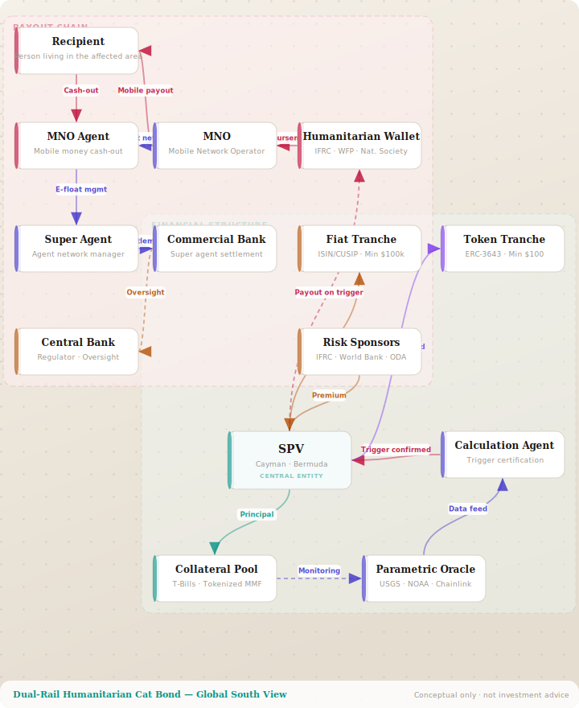

# Parametric Insurance — Cat Bond Modelling Suite

<div align="center">

### ▶ [Bond Structure Diagram](https://xvoll.github.io/TBC-soon/)  ·  [Cost Calculator](https://xvoll.github.io/TBC-soon/calculator/)  ·  [Stakeholder Map](https://xvoll.github.io/TBC-soon/stakeholders/)

[](https://xvoll.github.io/TBC-soon/)
[](https://xvoll.github.io/TBC-soon/calculator/)
[](https://xvoll.github.io/TBC-soon/stakeholders/)

**All tools run in the browser — no install required**

</div>

---

**Three complementary tools for modelling, visualising, and mapping the CCHB ecosystem**

| Tool | Stack | Folder | Purpose |
|---|---|---|---|
| **Bond Structure Diagram** | React · Vite | `schema/` | Interactive diagram of the full dual-rail structure — draggable nodes, Global North / South view |
| **Cost & Flow Calculator** | React · Vite | `calculator/` | Adjust financial parameters and see live cost flows across all funding layers |
| **Stakeholder Map** | React · Vite | `stakeholders/` | Searchable taxonomy of 182 actors across 16 categories — filter, search, donor gap analysis, precedent instruments |

---

## Tool 1 — Bond Structure Diagram (`schema/`)



*Frozen snapshot of the interactive diagram (Global South view — Recipient at top). Run `schema/` locally for the live, draggable version.*

An interactive React + Vite single-page app with three tabs:

| Tab | Content |
|---|---|
| **Structure** | Draggable SVG node-and-edge diagram. Click any node to read its role in the side panel. Toggle between **Global South view** (Recipient at top, default) and **Global North view** (SPV/finance at top) with an animated 700ms position flip. Toggle is hidden on other tabs to keep the header height constant. |
| **Rails** | Full-width side-by-side comparison: fiat rail vs. token rail (settlement, KYC, minimum investment, coupon, secondary market). |
| **Trigger** | Full-width numbered step-by-step sequence from event detection → oracle → calculation agent → dual payout → MNO disbursement. |

### Bond structure — stakeholders and roles

**Payout chain — first-mile delivery**

| Actor | Role |
|---|---|
| **Recipient** | Individual living in the affected area. Receives payout on mobile wallet, cashes out via a local MNO agent |
| **MNO** (Mobile Network Operator) | Operates the mobile money platform (e.g. MTN, Orange, Airtel). Handles targeting, KYC, transfer execution, and agent network management |
| **MNO Agent** | Local mobile money agent providing cash-out services; maintains e-float to convert digital balances to physical cash |
| **Humanitarian Wallet** | Pre-authorised wallet held by a humanitarian org (IFRC, WFP) that receives payout automatically on trigger; disburses to MNO |
| **Super Agent** | Manages and supplies a network of MNO agents; responsible for e-float distribution and reconciliation |
| **Commercial Bank** | Holds the super agent's settlement account and e-float liquidity pool |
| **Central Bank** | Licenses and regulates the mobile money ecosystem; provides oversight of commercial banks in the payout chain |

**Financial structure**

| Actor | Role |
|---|---|
| **Risk Sponsors** | Pay the cat bond risk premium on behalf of beneficiaries (philanthropy, multilateral funds, ODA) |
| **SPV** (Special Purpose Vehicle) | Single legal entity that simultaneously issues fiat notes (ISIN/CUSIP) and ERC-3643 security tokens against the same collateral pool |
| **Fiat Tranche** | Traditional institutional notes — DTCC/Euroclear settlement, wire coupons, min $100k–$250k |
| **Token Tranche** | ERC-3643 security tokens — KYC/AML in transfer logic, USDC coupons, min $100–$1k |
| **Collateral Pool** | Bond principal held in T-bills and tokenized money market funds for the full term |
| **Parametric Oracle** | On-chain data feed (Chainlink, USGS, NOAA) that makes event data available to the smart contract |
| **Calculation Agent** | Licensed third party that certifies whether the trigger index has crossed the threshold — binding for both rails |

### Money flow — step by step

```
Risk Sponsors (donors / ODA / philanthropy)
       │
       └──► Risk premium ────────────────────────────────────────────┐
                                                                      ▼
Bond holders (Fiat Tranche / Token Tranche)                    Issuer / SPV
       │                                                              │
       └──► Principal (collateral) ──────────────────────────────► Collateral Pool
                                                                      │
                              Yield on T-bills ◄────────────────────┘
                                                                      │
                                         Oracle monitors event index  │
                                         Calculation Agent certifies  │
                                                                      ▼
                                                            Threshold breached?
                                                                  YES ▼
                                                        Humanitarian Wallet
                                                                      │
                                                                      ▼
                                                                    MNO
                                                     ┌──────────────────────┐
                                                     │ Targeting · KYC      │
                                                     │ Transfer execution   │
                                                     │ Agent network mgmt   │
                                                     └──────────────────────┘
                                                                      │
                                                                      ▼
                                                               Recipient
                                                       Receives on mobile wallet
                                                       Cashes out via MNO Agent
                                                       ── Agent ── Super Agent
                                                                ── Bank
                                                                ── Central Bank
```

### Running locally

```bash
cd schema/
npm install
npm run dev -- --port 3839
```

See [`schema/EXPLAINER.md`](schema/EXPLAINER.md) for a full code walkthrough.

---

## Tool 2 — Cost & Flow Calculator (`calculator/`)

An interactive React app that models the full financial structure across four risk layers.

### Risk layers modelled

| Layer | Return period | Payout / person | Annual probability | Funded by |
|---|---|---|---|---|
| High frequency | 1:10 | USD 500 | 10.00% | Climate Smart Solution (other providers) |
| Medium-high | 1:15 | USD 1 000 | 6.67% | Climate Smart Agri + Others (donors) |
| Medium | 1:20 | USD 1 500 | 5.00% | Reinsurance (donors pay premium) |
| Catastrophic | 1:50 | USD 2 000 | 2.00% | Cat Bond (ILS investors; donors pay risk premium) |

### Key parameters (evidence-based defaults, March 2026)

| Parameter | Default | Source |
|---|---|---|
| Cat bond risk premium multiple | **3.0×** EAL | Artemis Q4 2025 ILS Market Report |
| Swiss T-bond yield | **0.40%** | Swiss 10-year, March 2026 |
| Reinsurance multiple | **2.0×** EAL | Swiss Re parametric market data |
| Climate Smart Agri cost | **USD 60**/person/yr | One Acre Fund 2024 |
| USD / CHF exchange rate | **0.79** | March 2026 |

### Running locally

```bash
cd calculator/
npm install
npm run dev -- --port 3840
```

See [`calculator/EXPLAINER.md`](calculator/EXPLAINER.md) for a full code walkthrough.

---

## Tool 3 — Stakeholder Map (`stakeholders/`)

A searchable, filterable **card taxonomy browser** of the full CCHB ecosystem — 182 actors across 16 categories with a dedicated donor gap analysis.

### Categories

| Category | Role in CCHB |
|---|---|
| Think tank / coordinator | Standards, learning, CVA & AA advocacy |
| Donor / funder | Bilateral, foundation, premium payers, grants |
| Impact finance / blended | Blended tranches, SDG capital, impact AM, DFIs |
| Parametric insurer | Designs, underwrites & bears parametric risk |
| Risk modeller / data trigger | Cat models, trigger indices, hazard verification |
| Cat bond / ILS infrastructure | SPV structuring, issuance, blockchain settlement |
| Blockchain / DeFi insurance | On-chain parametric, smart contract, DeFi capital |
| ILS investor | Provides ILS capital, absorbs principal-at-risk |
| Re/insurer | Capacity provider, risk carrier, treaty layer |
| Broker / structuring agent | Placement, deal structuring, advisory |
| DFS / MNO / payment | Last-mile wallet rails, aggregators, remittance |
| CVA / field implementer | Beneficiary registration, cash delivery, EAP ops |
| Data / analytics / tech | IM, geospatial, early warning, comms infra |
| UN — risk finance & DRF | Sovereign risk pools, cat bond issuance, DRF |
| UN — humanitarian operations | Field ops, CVA delivery, pooled humanitarian funds |
| **Precedent instrument** | Documented CCHB-type mechanism already deployed — sovereign parametric pool, pooled fund, or trigger-based payout |

### Features

- **Filter** by category or by "newly recommended" actors not yet formally engaged
- **Search** across name, role description, and tags
- **Donor gap analysis** panel — 10 priority funders ranked by funding role (premium subsidy → proof-of-concept grant → DFI first-loss → ecosystem convener)
- **Precedent instrument** category — CRIF, Jamaica CAT Bond, ARC, DREF Anticipatory Action: documented mechanisms structurally analogous to CCHB

### Data & CSV sync

The stakeholder data lives in both `src/data.js` (React) and `data/*.csv` (spreadsheet-friendly), kept in strict sync:

| Action | Command |
|---|---|
| Edit `data.js`, regenerate CSVs | `npm run dev` or `npm run build` — auto-runs on start |
| Edit a CSV, regenerate `data.js` | `npm run import-csv` |

CSV files: `data/actors.csv` (182 rows) · `data/categories.csv` (16)

### Running locally

```bash
cd stakeholders/
npm install
npm run dev   # exports CSVs automatically, then starts on http://localhost:3841
```

See [`stakeholders/EXPLAINER.md`](stakeholders/EXPLAINER.md) for a full walkthrough of the data schema, CSV sync, and features.

---

## Repository structure

```
parametric-insurance/
├── schema/
│   ├── src/
│   │   ├── catbond-diagram.jsx   ← React component (all diagram logic)
│   │   └── main.jsx
│   ├── snapshot.svg              ← Frozen SVG snapshot (used in this README)
│   ├── EXPLAINER.md
│   ├── index.html
│   ├── package.json
│   └── vite.config.js
├── calculator/
│   ├── src/                      ← React cost calculator
│   ├── EXPLAINER.md
│   ├── index.html
│   ├── package.json
│   └── vite.config.js
├── stakeholders/
│   ├── src/
│   │   ├── App.jsx               ← Card taxonomy browser
│   │   ├── App.css
│   │   └── data.js               ← CATS, ACTORS, DONOR_ANALYSIS
│   ├── EXPLAINER.md
│   ├── index.html
│   ├── package.json
│   └── vite.config.js
└── README.md
```

---

*Built with React · Vite · ERC-3643*
